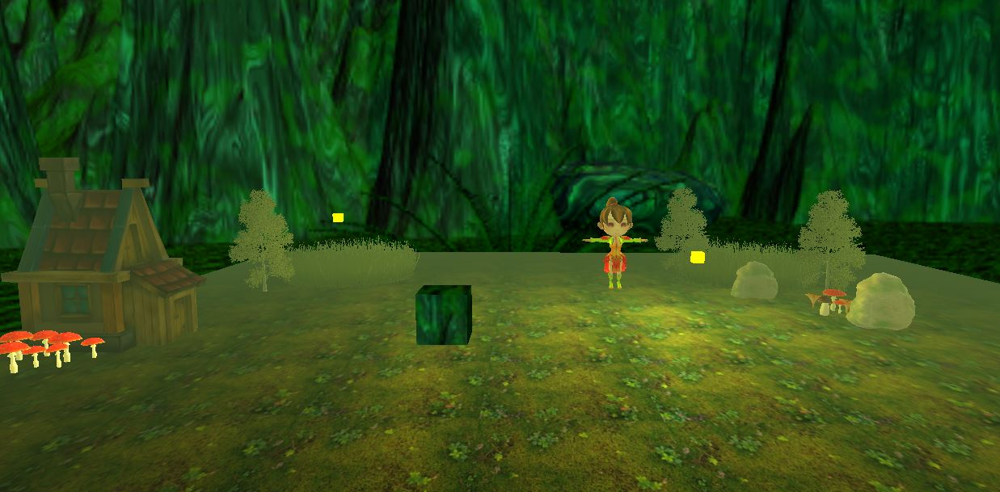
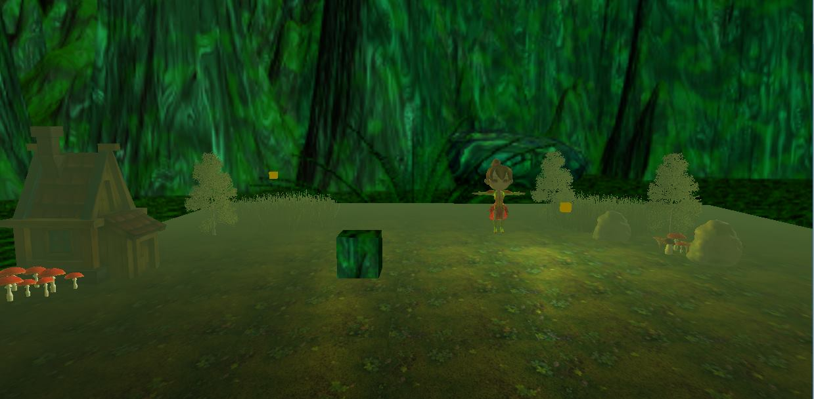
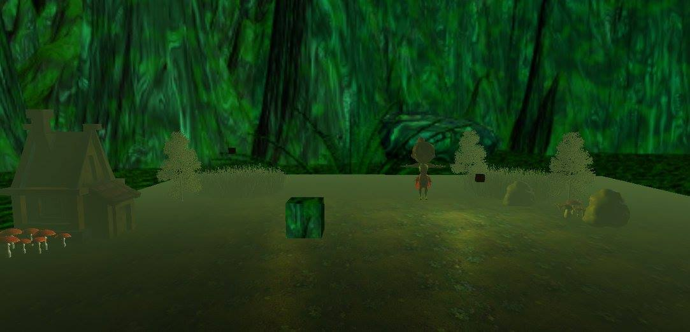
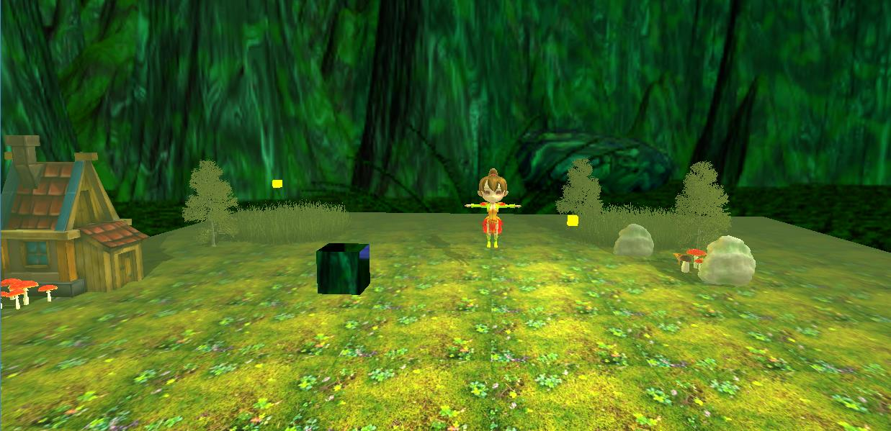
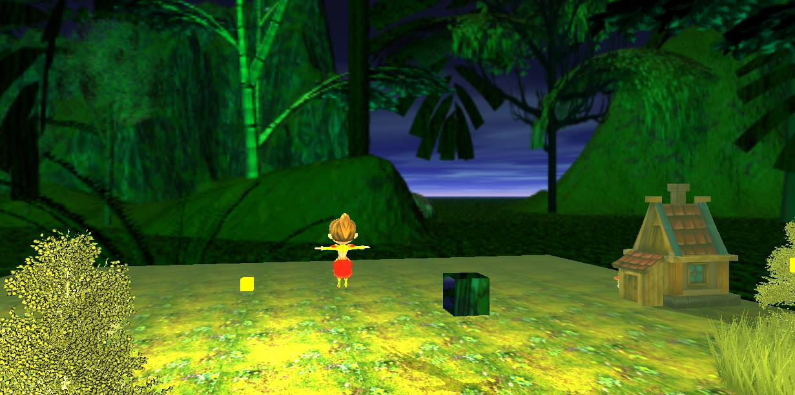
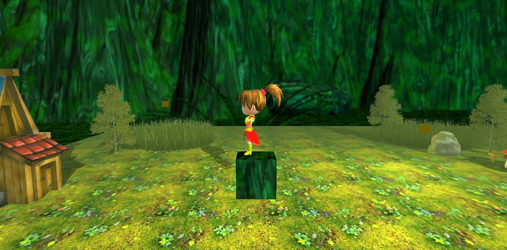
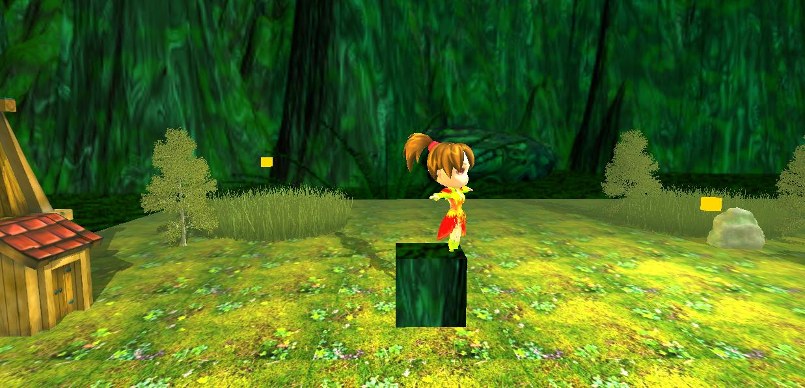
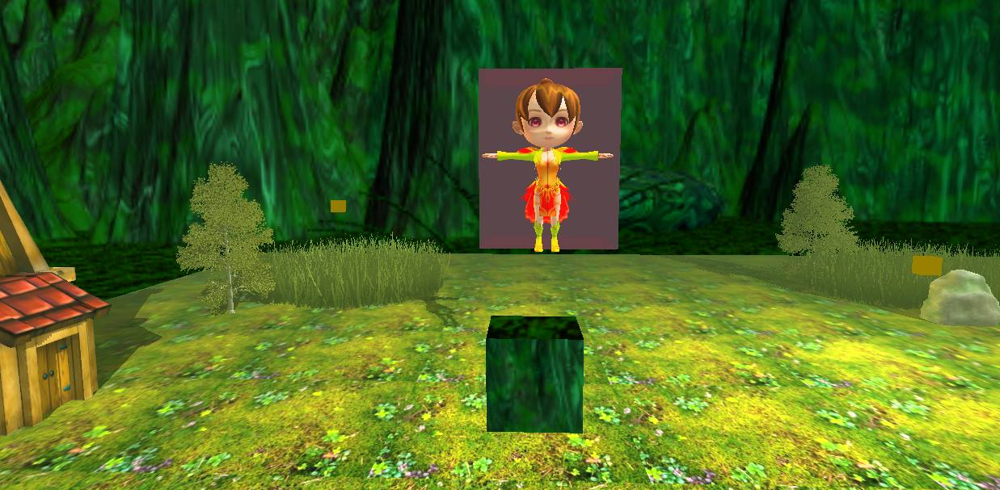
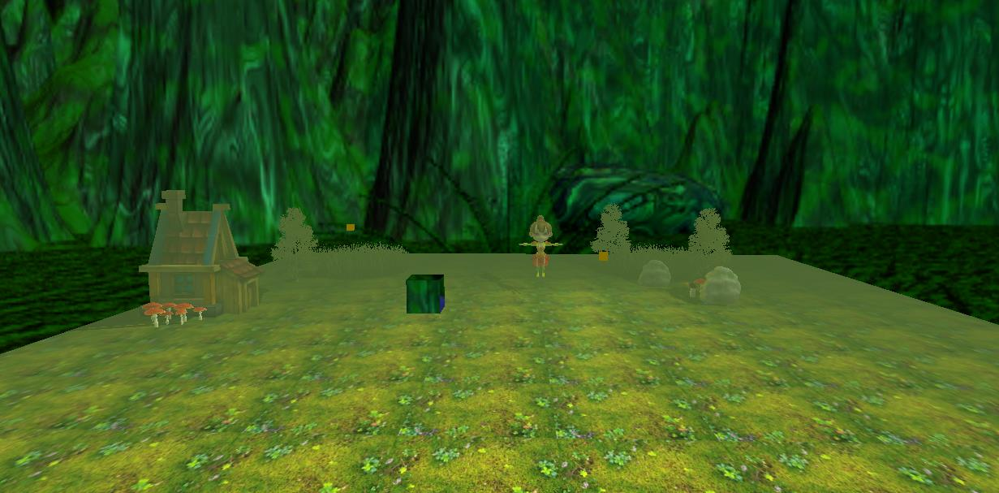

# A 3D dynamic fairy scene, using OpenGL

### Description ###
The project herein presents a scene from a fairytale, focusing on a fairy in her natural environment, in dim lit foggy woods, at twilight. 
She is surrounded by her fairy house, her garden with mushrooms and flowers,
whilst being accompanied by lighting fire flies.
The scene also presents a "magical cube" that transforms the fairy giving her a red glow after she dives in it.

### Running the program ###
In order to open the program, one must clone the repository and open the Microsoft Visual Studio 
executable file, with the ".sln" extension. 
Afterwards, click Ctrl + F5 to run the release version.

### Functionalities: ###
* 'O' key: turns the directional light on/off
* 'P' key: turns the point light on/off (along with the cube which represents it)
* key 1 (directional light)/ 2 (point light) &
 * X/C- move the light on the X axis
 * Y/V- move the light on the Y axis
 * Z/B- move the light on the Z axis
* 'M' key: changes the viewing mode: solid, wireframe, point.
* keys which move the camera:
 * 'W': forward;
 * 'S': backwards;
 * 'A': to the left;
 * 'D': to the right;
* 'E' & 'Q' keys rotate the camera on a circle arround the central point of the scene; this move is for presentation purposes, the camera returning in its previous position after releasing the keys;
* 'Enter' key: starts the presentation demo:
 * the camera will start a presentation rotation around the scene
 * the camera will return to the starting point
 * the fairy will move towards the magical cube
 * once there, the fairy will dive in the cube
 * upon ascending from the cube, the fairy will self-rotate a couple of times
 * when finishing the rotations, the fairy will be surrounded by a red light (generated cube)
 * after holding the posture for a couple of seconds, the fairy will return to the original place

The _mouse_ will allow the user to rotate the camera dynamically around the scene, in order to better observe it.
The point light sources- the fire flies, will gradually fade in and fade out.

### Algorithms used: ###
* Blinn-Phong illumination algorithm
* Lighting Maps for texture coloring the objects
* Shadow Mapping for shadow representation
* Skyboxing
* Fog generation
* Color Blending

### Results: ###

_Fading Lights:_

_With Directional Light - clearer shadows:_

_Rear view:_

_Rotation & Transformation:_

_Fog:_

